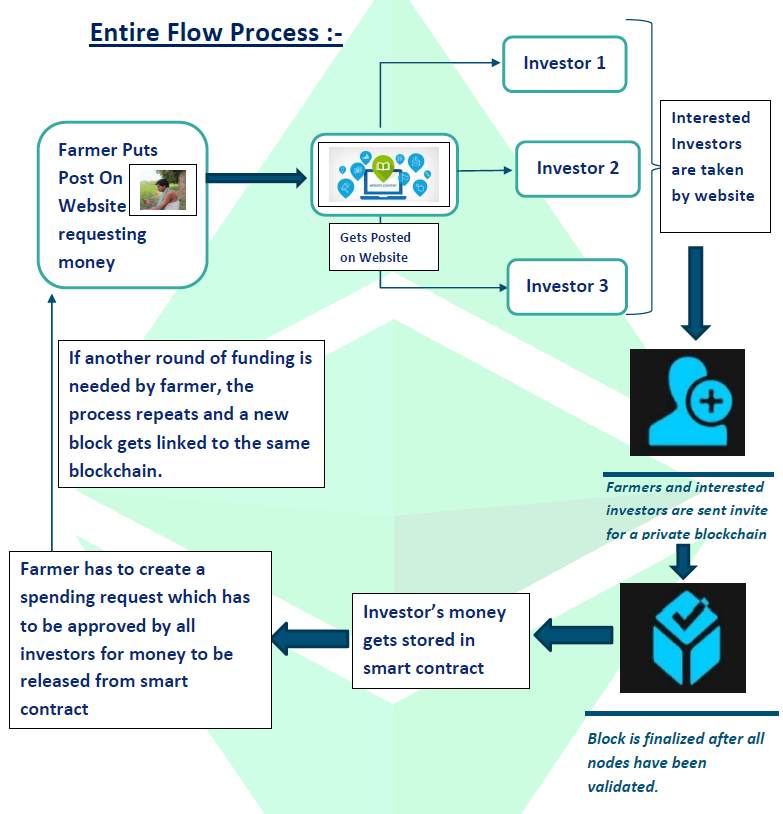

# Farmville
## Decentralised Contract Farming Platform

### Problem Description :-
Our Web-app efficiently tackles the following three major problems in agricultural sector:- \
1.) Meeting farmer’s demand for financial support at the beginning of cropping season for seeds, fertilizers etc. without involving banks, moneylenders etc. \
2.) Overcoming the shortcomings of contract farming. \
3.) Misuse of investor’s money by fraudulent farmers for uses other than those mentioned in contract. 

### OUR SOLUTION- 
Our Web-app enables farmers to raise money whenever required
as per requirement in any stage of crop production. Since this money is in the form of investment, no interest rate is there

### Overview :-
• To create an online decentralised space for farmers where they can raise money from investors during different stages of cropping season whenever they require it in return of which they provide incentive to investors as mentioned in contract that has been agreed upon by both parties.\
• Entire process for carrying out transactions will be based on blockchain. Thus, the flow of money from investors to farmers can be easily tracked. Since flow of money from investors to farmers and that by farmers to vendors for expenditure can be tracked, the defaulting party can be easily identified in case of any legal dispute.\
• Investors will have the power to approve the expenditure of money provided by them to the farmers. Only once they are satisfied that the money being provided by them will be used in right place, they will approve its expenditure and funds will be released.

### CONCLUSION –
1. The Web app creates a safe, transparent and decentralized environment for both farmers as well as investors by overcoming existing discrepancies in existing system of contract farming.\
2. Farmers can raise money whenever required and will remain insured from debt trap which exists in present system of agriculture. \
3. The web app provides control in the hand of investors with the help of its innovative ‘spending function’ to prevent misuse of their resources and will also significantly reduce number of contract defaults by fraudulent farmers. \
4. Legal disputes, if any, can now be solved much easily as a permanent online ledger is being maintained. Thus, the party not fulfilling the terms of agreement can easily be traced.

## Flow Chart

## Available Scripts

In the project directory, you can run:

### `npm start`

Runs the app in the development mode.\
Open [http://localhost:3000](http://localhost:3000) to view it in the browser.

The page will reload if you make edits.\
You will also see any lint errors in the console.

### `npm test`

Launches the test runner in the interactive watch mode.\
See the section about [running tests](https://facebook.github.io/create-react-app/docs/running-tests) for more information.

### `npm run build`

Builds the app for production to the `build` folder.\
It correctly bundles React in production mode and optimizes the build for the best performance.

